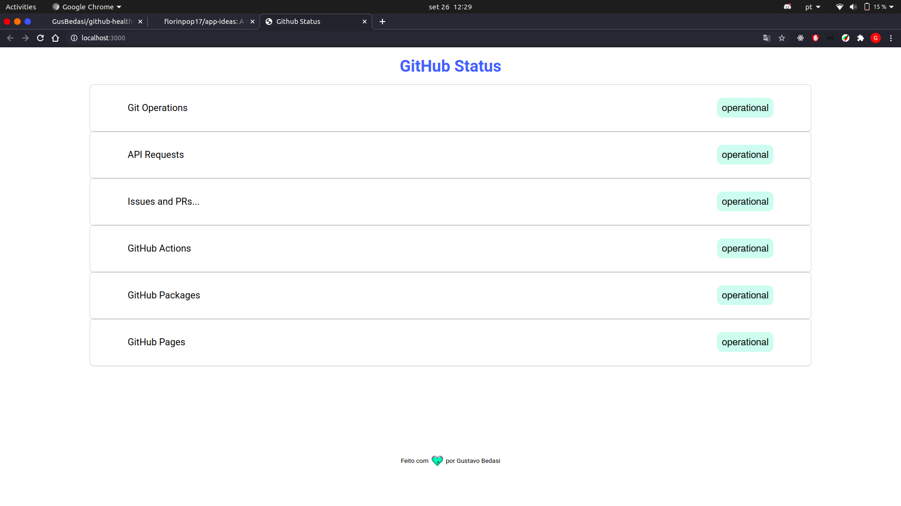

# Github health checker

 

## Idea
Aplicação feita com objetivo de checar status operacional do github e apresentar no HTML, foi feito com HTML, Css, javascript e browserify.

## Usage
Necessário instalar as dependências e buildar o bundle.js
```
yarn add
yarn build
```


Mais um desafio do repositório de idéias de app. Confira o link a seguir: https://github.com/florinpop17/app-ideas